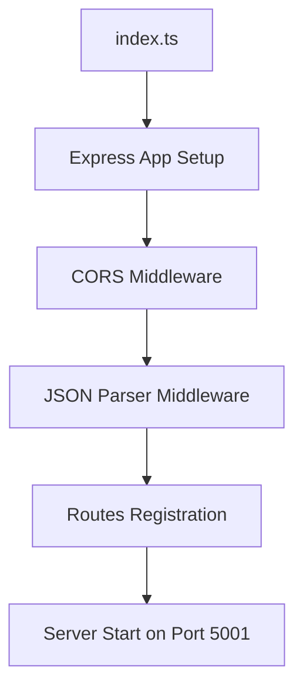
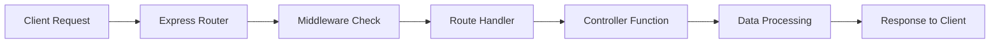

# Backend Architecture Documentation

## 📋 Tổng quan

Dự án backend được xây dựng với Node.js, TypeScript và Express.js, theo kiến trúc MVC (Model-View-Controller) với các thành phần được tổ chức theo nguyên tắc tách biệt trách nhiệm.

## 🗂️ Cấu trúc thư mục

```
backend/
├── index.ts                    # Entry point của ứng dụng
├── package.json               # Dependencies và scripts
├── tsconfig.json              # TypeScript configuration
├── API_ENDPOINTS.md           # Tài liệu API endpoints
├── ARCHITECTURE.md            # File này - tài liệu kiến trúc
└── src/
    ├── controllers/           # Logic xử lý business
    │   ├── authController.ts      # Xác thực và phân quyền
    │   ├── sessionController.ts   # Quản lý phiên học
    │   ├── studentController.ts   # Quản lý học sinh
    │   ├── tutorController.ts     # Quản lý gia sư
    │   ├── messageController.ts   # Hệ thống tin nhắn
    │   ├── libraryController.ts   # Thư viện tài liệu
    │   ├── evaluationController.ts # Đánh giá và feedback
    │   ├── analyticController.ts  # Báo cáo và phân tích
    │   ├── reportController.ts    # Xuất báo cáo
    │   ├── requestController.ts   # Xử lý yêu cầu đặc biệt
    │   └── userController.ts      # Quản lý người dùng
    ├── routes/                # Định tuyến API
    │   ├── auth.ts               # Đường dẫn xác thực
    │   ├── sessions.ts           # Đường dẫn quản lý phiên
    │   ├── students.ts           # Đường dẫn học sinh
    │   ├── tutors.ts             # Đường dẫn gia sư
    │   ├── messages.ts           # Đường dẫn tin nhắn
    │   ├── library.ts            # Đường dẫn thư viện
    │   ├── evaluations.ts        # Đường dẫn đánh giá
    │   ├── analytics.ts          # Đường dẫn phân tích
    │   ├── reports.ts            # Đường dẫn báo cáo
    │   └── requests.ts           # Đường dẫn yêu cầu
    ├── data/                  # Mock data và models
    │   ├── account.ts            # Dữ liệu tài khoản
    │   ├── student.ts            # Dữ liệu học sinh
    │   ├── tutor.ts              # Dữ liệu gia sư
    │   ├── session.ts            # Dữ liệu phiên học
    │   ├── message.ts            # Dữ liệu tin nhắn
    │   ├── lib_resource.ts       # Dữ liệu thư viện
    │   ├── student_evaluation.ts # Dữ liệu đánh giá
    │   ├── reschedule_request.ts # Dữ liệu yêu cầu đổi lịch
    │   ├── available_subject.ts  # Dữ liệu môn học
    │   └── admin.ts              # Dữ liệu admin
    ├── middleware/            # Middleware functions
    │   ├── authMiddleware.ts     # Xác thực JWT token
    │   └── requireUserId.ts      # Yêu cầu userId trong request
    ├── types/                 # Type definitions
    │   └── type.ts              # Các interface và type định nghĩa
    └── utils/                 # Utility functions
        └── db.ts                # Database utilities (mock)
```

## 🔄 Luồng hoạt động

### 1. Khởi tạo ứng dụng



### 2. Xử lý HTTP Request



### 3. Kiến trúc MVC

#### **Routes Layer** (Tầng định tuyến)

- **Mục đích**: Định nghĩa các endpoints và liên kết với controllers
- **Trách nhiệm**:
  - Xử lý HTTP methods (GET, POST, PUT, DELETE, PATCH)
  - Áp dụng middleware cho từng route
  - Chuyển tiếp request đến controller tương ứng

#### **Controllers Layer** (Tầng điều khiển)

- **Mục đích**: Xử lý logic business và tương tác với dữ liệu
- **Trách nhiệm**:
  - Nhận và validate input từ routes
  - Thực hiện logic xử lý
  - Tương tác với data layer
  - Trả về response cho client

#### **Data Layer** (Tầng dữ liệu)

- **Mục đích**: Quản lý và lưu trữ dữ liệu (hiện tại là mock data)
- **Trách nhiệm**:
  - Cung cấp dữ liệu mock cho development
  - Định nghĩa cấu trúc dữ liệu
  - Sẵn sàng để tích hợp với database thực

## 🛣️ API Endpoints chính

### Authentication (`/api/auth`)

- `POST /login` - Đăng nhập
- `POST /change-password` - Đổi mật khẩu

### Sessions (`/api/sessions`)

- `GET /` - Lấy danh sách phiên học
- `GET /:id` - Lấy thông tin phiên học
- `POST /` - Tạo phiên học mới
- `PATCH /:id` - Cập nhật phiên học
- `DELETE /:id` - Xóa phiên học
- `POST /:id/join` - Tham gia phiên học
- `POST /:id/leave` - Rời phiên học
- `POST /:id/complete` - Hoàn thành phiên học
- `POST /:id/reschedule` - Yêu cầu đổi lịch
- `POST /auto-match` - Tự động ghép gia sư

### Students (`/api/students`)

- `GET /` - Lấy danh sách học sinh
- `GET /:id` - Lấy thông tin học sinh
- `POST /` - Tạo học sinh mới
- `PATCH /:id` - Cập nhật học sinh
- `DELETE /:id` - Xóa học sinh

### Tutors (`/api/tutors`)

- `GET /` - Lấy danh sách gia sư
- `GET /:id` - Lấy thông tin gia sư
- `POST /` - Tạo gia sư mới
- `PATCH /:id` - Cập nhật gia sư
- `DELETE /:id` - Xóa gia sư

### Messages (`/api/messages`)

- `GET /conversations` - Lấy danh sách cuộc trò chuyện
- `GET /` - Lấy tin nhắn
- `POST /` - Gửi tin nhắn
- `GET /notifications` - Lấy thông báo
- `PATCH /:id/read` - Đánh dấu đã đọc

### Library (`/api/library`)

- `GET /resources` - Lấy tài liệu thư viện
- `GET /resources/:id/download` - Tải tài liệu

### Evaluations (`/api/evaluations`)

- `GET /` - Lấy danh sách đánh giá
- `GET /:id` - Lấy thông tin đánh giá
- `POST /` - Tạo đánh giá mới
- `PUT /:id` - Cập nhật đánh giá
- `DELETE /:id` - Xóa đánh giá

## 🔒 Security & Middleware

### Authentication Middleware

- **File**: `src/middleware/authMiddleware.ts`
- **Chức năng**: Verify JWT tokens, protect routes

### User ID Requirement

- **File**: `src/middleware/requireUserId.ts`
- **Chức năng**: Đảm bảo requests có userId hợp lệ

## 📊 Data Management

### Mock Data Strategy

Hiện tại sử dụng mock data để phát triển và test:

- **Ưu điểm**: Phát triển nhanh, không phụ thuộc database
- **Nhược điểm**: Dữ liệu không persistent
- **Future**: Sẵn sàng migration sang database thực (MongoDB, PostgreSQL, etc.)

### Type Safety

- Sử dụng TypeScript cho type safety
- Định nghĩa interfaces trong `src/types/type.ts`
- Đảm bảo consistency giữa frontend và backend

## 🚀 Development Guidelines

### Code Organization

1. **Single Responsibility**: Mỗi controller chỉ xử lý một domain
2. **Consistent Naming**: Sử dụng camelCase cho functions, PascalCase cho types
3. **Error Handling**: Luôn có try-catch và meaningful error messages
4. **Logging**: Console.log cho debugging, structured logging cho production

### API Design

1. **RESTful**: Tuân thủ REST principles
2. **HTTP Status Codes**: Sử dụng đúng status codes
3. **Consistent Response**: Cấu trúc response nhất quán
4. **Validation**: Validate input parameters và body

### Future Enhancements

1. **Database Integration**: Replace mock data với real database
2. **Authentication**: Implement proper JWT handling
3. **Validation**: Add input validation middleware
4. **Logging**: Implement structured logging
5. **Testing**: Add unit và integration tests
6. **Documentation**: Auto-generate API docs với Swagger

## 🛠️ Development Commands

```bash
# Cài đặt dependencies
npm install

# Chạy development server
npm run dev

# Build cho production
npm run build

# Chạy production server
npm start
```

## 📝 Notes

- Server chạy trên port 5001
- CORS được enable cho tất cả origins
- JSON parsing middleware đã được cấu hình
- Tất cả routes được prefix với `/api`
- Mock data được load từ `src/data/` folder
